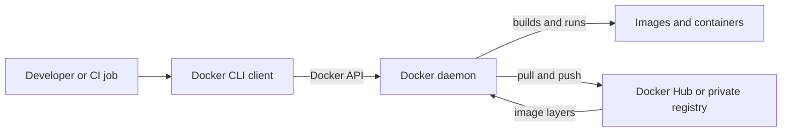
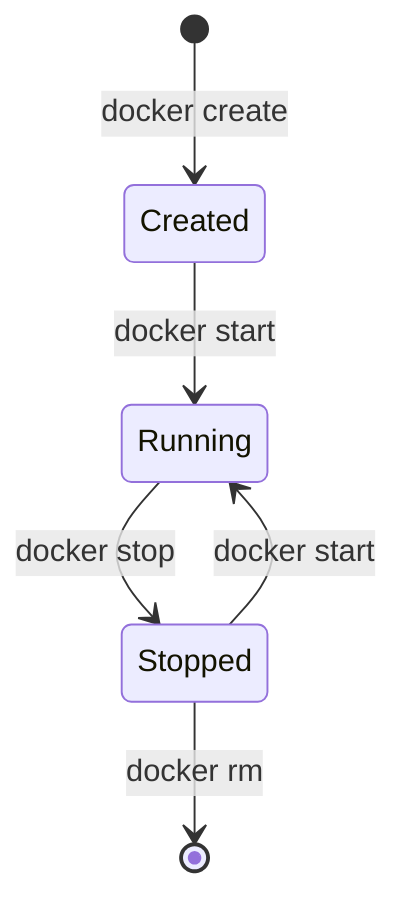

Containers package an application and its dependencies into a portable unit that runs consistently from a developer laptop to a production server. Docker is the most common toolchain for building, distributing, and running those units.

<Note>
  This page uses Docker commands. Install Docker Desktop or Docker Engine before running the examples, and verify the daemon is available with `docker version`.
</Note>

## 1. What is a container?

A container is an isolated process on a host operating system. It gets its own filesystem, process tree, network settings, and environment variables, while sharing the host kernel through operating-system features such as namespaces and control groups.

Unlike a traditional server, a container is usually designed to be disposable. Store durable data in a volume or external service, not only in the container's writable layer.

### Use case: consistent application environments

Imagine a team building a Python API. One developer has Python 3.12, another has Python 3.11, and the CI server has different system libraries. A container image can package the application, Python runtime, and required libraries together. Each environment then runs the same artifact.

<CardGroup cols={2}>
  <Card title="Good fit" icon="check">
    Repeatable development environments, CI jobs, web services, workers, and short-lived data processing tasks.
  </Card>
  <Card title="Remember" icon="triangle-exclamation">
    Containers improve isolation and portability, but they do not replace application security, backups, or resource limits.
  </Card>
</CardGroup>

## 2. Containers vs. virtual machines

Both technologies isolate workloads, but they isolate at different layers. A virtual machine virtualizes hardware and boots a complete guest operating system. A container isolates processes while using the host kernel.

| Characteristic | Container | Virtual machine |
| --- | --- | --- |
| Isolation boundary | Process and kernel features | Virtualized hardware and guest OS |
| Includes a full OS | No | Yes |
| Typical startup | Seconds or less | Seconds to minutes |
| Resource overhead | Usually lower | Usually higher |
| Best for | Dense, portable application workloads | Strong OS isolation, different kernels, and legacy systems |

<Tip>
  Containers are not universally "better" than virtual machines. A common production design runs containers inside virtual machines to combine operational flexibility with a stronger infrastructure boundary.
</Tip>

## 3. Docker architecture

Docker uses a client-server model. The command you type is handled by the Docker client, which sends an API request to the Docker daemon. The daemon builds images, starts containers, and communicates with registries.



<Columns>
  <Card title="Client" icon="terminal">
    The `docker` command-line interface. It translates commands such as `docker run` and `docker build` into API requests.
  </Card>
  <Card title="Daemon" icon="server">
    The background service, often called `dockerd`. It manages images, containers, networks, and volumes on a host.
  </Card>
  <Card title="Registry" icon="cloud-arrow-up">
    A service that stores and distributes image repositories. Docker Hub is public by default; organizations can use private registries.
  </Card>
</Columns>

## 4. Docker images vs. containers

An image is a read-only, versioned template. It contains the filesystem and metadata needed to start an application. A container is a runtime instance created from that image, with a small writable layer and a lifecycle of its own.

| Image | Container |
| --- | --- |
| Immutable template | Running or stopped instance |
| Stored locally or in a registry | Managed by the Docker daemon |
| Can create many containers | Can be removed and recreated from the image |
| Identified by a tag or digest | Identified by a name and container ID |

For example, `nginx:1.27` is an image reference. `web` can be a container created from that image:

```bash
docker pull nginx:1.27
docker run --detach --name web --publish 8080:80 nginx:1.27
docker ps
```

Open `http://localhost:8080` to reach the Nginx process inside the container. The host port `8080` is mapped to the container port `80`.

## 5. Dockerfile: the basic structure

A `Dockerfile` is a build recipe. Each instruction contributes to an image layer or configures how a container should start.

```dockerfile
FROM nginx:1.27-alpine
COPY index.html /usr/share/nginx/html/index.html
EXPOSE 80
```

<AccordionGroup>
  <Accordion title="Common instructions">
    `FROM` selects the base image. `WORKDIR` sets the default directory. `COPY` adds local files. `RUN` executes build-time commands. `ENV` defines environment variables. `EXPOSE` documents a listening port. `CMD` defines a default command. `ENTRYPOINT` defines the main executable.
  </Accordion>
  <Accordion title="Build context and .dockerignore">
    The final `.` in `docker build -t demo-web:1.0 .` is the build context. Add a `.dockerignore` file to keep secrets, dependency folders, Git metadata, and generated files out of that context.
  </Accordion>
</AccordionGroup>

Build and run the image:

```bash
docker build --tag demo-web:1.0 .
docker run --detach --name demo-web --publish 8080:80 demo-web:1.0
```

<Warning>
  Do not put passwords, API keys, or private certificates in a `Dockerfile`. Image layers can preserve data even after a later instruction deletes it. Use runtime secrets or a secret manager instead.
</Warning>

## 6. Container lifecycle

The lifecycle separates creating a container's configuration from starting its process. In day-to-day work, `docker run` commonly performs both steps at once.

<Steps>
  <Step title="Create">
    Create a stopped container from an image.

    ```bash
    docker create --name lifecycle-demo nginx:1.27
    ```
  </Step>
  <Step title="Run">
    Start the container's main process.

    ```bash
    docker start lifecycle-demo
    docker ps
    ```
  </Step>
  <Step title="Stop">
    Ask the main process to shut down gracefully.

    ```bash
    docker stop lifecycle-demo
    docker ps --all
    ```
  </Step>
  <Step title="Delete">
    Remove the stopped container and its writable layer. The image remains available.

    ```bash
    docker rm lifecycle-demo
    docker image ls nginx
    ```
  </Step>
</Steps>



<Note>
  A stopped container is not the same as a deleted container. Keep it when you need logs or configuration for investigation; remove it when the workload is disposable and you have finished debugging.
</Note>

## Docker command reference

Use this table as a quick demo reference. The output examples are representative; IDs, timestamps, ports, and digests vary between environments.

| Docker command | Explanation | Sample output | Error sample |
| --- | --- | --- | --- |
| `docker version` | Displays the Docker client and daemon versions. | `Client: Docker Engine - Community`<br />`Server: Docker Engine - Community` | `Cannot connect to the Docker daemon` |
| `docker info` | Shows detailed information about the Docker daemon, storage driver, images, containers, and host. | `Containers: 3`<br />`Images: 8` | `permission denied while trying to connect to the Docker daemon socket` |
| `docker pull nginx:1.27` | Downloads an image from a registry to the local machine. | `Status: Downloaded newer image for nginx:1.27` | `manifest for nginx:9.99 not found` |
| `docker images` or `docker image ls` | Lists images stored locally. | `nginx  1.27  abc123  2 weeks ago  188MB` | `Cannot connect to the Docker daemon` |
| `docker image inspect nginx:1.27` | Displays detailed image metadata, configuration, layers, and architecture. | `"Architecture": "amd64"`<br />`"Os": "linux"` | `No such image: nginx:1.27` |
| `FROM nginx:1.27-alpine` | Dockerfile instruction that selects the base image for a new image. | `FROM nginx:1.27-alpine` | `pull access denied for nginx` |
| `COPY index.html /usr/share/nginx/html/index.html` | Dockerfile instruction that copies a file from the build context into the image. | `COPY index.html ...` | `COPY failed: file not found in build context` |
| `EXPOSE 80` | Dockerfile instruction that documents container port 80 as the application's listening port. It does not publish the port to the host by itself. | `EXPOSE 80` | No direct error; the application may not actually listen on port 80. |
| `docker run --detach --name web --publish 8080:80 nginx:1.27` | Creates and starts a new container. `--detach` runs in the background, `--name` assigns a name, and `--publish` maps host port 8080 to container port 80. | `7a1b2c3d4e5f...` | `docker: Error response from daemon: Conflict. The container name "/web" is already in use.` |
| `docker ps` | Lists running containers. `ps` means **process status**. | `CONTAINER ID  IMAGE  STATUS  NAMES`<br />`7a1b2c3d4e5f  nginx  Up 10 seconds  web` | `Cannot connect to the Docker daemon` |
| `docker ps --all` | Lists all containers, including running, stopped, and exited containers. | `web  nginx:1.27  Exited (0) 2 minutes ago` | `unknown flag: --all` |
| `docker logs web` | Displays the standard output and error logs from a container. | `172.17.0.1 - - [03/Sep/2026] "GET / HTTP/1.1" 200` | `Error response from daemon: No such container: web` |
| `docker build --tag demo-web:1.0 .` | Builds an image from a Dockerfile and tags it as `demo-web:1.0`. The final `.` is the build context. | `Successfully tagged demo-web:1.0` | `failed to solve: failed to read dockerfile: open Dockerfile: no such file or directory` |
| `docker create --name lifecycle-demo nginx:1.27` | Creates a stopped container without starting its main process. | `c8d9e0f1a2b3...` | `Conflict. The container name "/lifecycle-demo" is already in use.` |
| `docker start lifecycle-demo` | Starts an existing stopped container. | `lifecycle-demo` | `Error response from daemon: No such container: lifecycle-demo` |
| `docker stop lifecycle-demo` | Gracefully stops a running container. | `lifecycle-demo` | `Error response from daemon: No such container: lifecycle-demo` |
| `docker rm lifecycle-demo` | Removes a stopped container and its writable layer. | `lifecycle-demo` | `Error response from daemon: cannot remove a running container` |
| `docker login` | Authenticates the Docker CLI with a registry such as Docker Hub. | `Login Succeeded` | `unauthorized: incorrect username or password` |
| `docker login registry.example.com` | Authenticates with a private registry. | `Login Succeeded` | `Get "https://registry.example.com/v2/": dial tcp: lookup registry.example.com: no such host` |
| `docker tag demo-web:1.0 your-docker-id/demo-web:1.0` | Adds a registry-compatible name to an existing local image without copying its layers. | No output on success. | `No such image: demo-web:1.0` |
| `docker push your-docker-id/demo-web:1.0` | Uploads image layers and the tag to a registry. | `1.0: digest: sha256:abc123... size: 1234` | `denied: requested access to the resource is denied` |

## 7. Docker Hub and registries

A registry is an image distribution service. An image repository contains tagged versions, and each image is composed of content-addressed layers. Docker Hub is the default public registry for many Docker commands.

An image reference usually follows this pattern:

```text
[registry-host/]namespace/repository:tag
```

Examples include `nginx:1.27`, `acme/payments-api:2026.09`, and `registry.example.com/platform/payments-api:1.4.2`.

<Tabs>
  <Tab title="Pull and inspect">
    ```bash
    docker pull nginx:1.27
    docker image ls
    docker image inspect nginx:1.27
    ```
  </Tab>
  <Tab title="Tag and push">
    ```bash
    docker login
    docker tag demo-web:1.0 your-docker-id/demo-web:1.0
    docker push your-docker-id/demo-web:1.0
    ```
  </Tab>
  <Tab title="Use a private registry">
    ```bash
    docker login registry.example.com
    docker tag demo-web:1.0 registry.example.com/platform/demo-web:1.0
    docker push registry.example.com/platform/demo-web:1.0
    ```
  </Tab>
</Tabs>

### Practical registry guidance

- Use meaningful, immutable version tags such as `1.4.2` for releases. Avoid relying on `latest` in production because it can point to a different image later.
- Prefer image digests when you need exact reproducibility, for example `nginx@sha256:<digest>`.
- Keep production repositories private when they contain proprietary code.
- Scan images for vulnerabilities and remove unnecessary packages from the final image.
- Grant push and pull access according to the minimum permissions each team or deployment system needs.

## A complete mini-workflow

This sequence connects the concepts: write a recipe, build an image, create a container, inspect it, and clean it up.

```bash
docker version
docker build --tag demo-web:1.0 .
docker run --detach --name demo-web --publish 8080:80 demo-web:1.0
docker ps
docker logs demo-web
docker stop demo-web
docker rm demo-web
```

<Check>
  You should now be able to explain that the Docker client asks the daemon to create a container from an image, and that a registry is where images can be shared between machines.
</Check>

## Reference links

- [Docker documentation](https://docs.docker.com/)
- [Docker get started](https://docs.docker.com/get-started/)
- [Dockerfile reference](https://docs.docker.com/reference/dockerfile/)
- [Docker Hub](https://hub.docker.com/)
- [Container fundamentals reference](https://docs.google.com/document/d/1RDi9T5PFT-qtVMMFGs22AVtM7ALxa2ATILk2By8TWQA/edit?usp=sharing)
