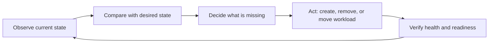

Container orchestration is the automated management of containers across one or more machines. An orchestrator schedules workloads, connects them to networks, replaces failed instances, and continuously works toward the state you declare.

### Example scenario

An online store may need three API instances during normal traffic and ten during a sale. An orchestrator can place those instances on available nodes, distribute requests, replace unhealthy instances, and scale back after demand drops.

Here, the **desired state** is the target condition declared by the team: for example, three healthy API replicas during normal traffic or ten healthy replicas during the sale. The **current state**, also called the actual or observed state, is what is really running at that moment. If the desired state is three replicas but only two are healthy, the orchestrator creates a replacement. The word "state" describes the complete target condition, not only the number of containers. It can also include the image version, networking, resource limits, and health status.

For this basic explanation, there are two states being compared:

- **Desired state**: what should be running.
- **Current state**: what is running now.

The orchestrator continuously compares these two states and takes action when they differ.

### How the control loop works

The orchestrator repeats the same control loop continuously:

1. **Observe**: Check the current cluster state. In this example, only two API replicas are healthy.
2. **Compare**: Compare the current state with the desired state of three healthy replicas.
3. **Decide**: Determine that one replica is missing.
4. **Act**: Select a worker node and start a replacement Pod or container.
5. **Verify**: Check whether the replacement is running and ready to receive traffic.
6. **Repeat**: Continue monitoring the application and respond to the next difference.

For example, when one API replica crashes:

```text
Desired state: 3 healthy replicas
Current state: 2 healthy replicas
Action: Create 1 replacement replica
```

After the replacement passes its health check, the states match again:

```text
Desired state: 3 healthy replicas
Current state: 3 healthy replicas
Action: No further change is needed
```

The control loop can also correct an incorrect image version, add replicas during high traffic, remove extra replicas during low traffic, or move workloads when a worker node fails.



## Problems without orchestration

Manual container operations become fragile as the number of services and hosts grows.

| Problem | Manual consequence | Orchestrator response |
| --- | --- | --- |
| A process crashes | An operator must notice and restart it | Self-healing replaces it |
| Traffic changes | Someone changes the number of instances | Autoscaling adjusts replicas |
| A host is full | Operators choose another server | Scheduler finds a suitable node |
| Instances move | Clients lose track of changing IP addresses | Service discovery provides stable names |
| A release fails | Teams manually restore the old version | Declarative rollouts and rollback help recover |

## Core features

<CardGroup cols={2}>
  <Card title="Auto-scaling" icon="arrows-up-down">
    Add or remove replicas based on CPU, memory, queue depth, or another measured signal.
  </Card>
  <Card title="Load balancing" icon="scale-balanced">
    Route traffic across healthy replicas instead of sending every request to one container.
  </Card>
  <Card title="Self-healing" icon="heart-pulse">
    Restart failed containers, replace unhealthy instances, and reschedule workloads after node problems.
  </Card>
  <Card title="Scheduling" icon="calendar-check">
    Place workloads according to resources, constraints, affinity rules, and available capacity.
  </Card>
</CardGroup>

## Auto-scaling

Suppose an API normally runs two replicas. An autoscaler observes rising CPU usage and changes the desired count to five. The scheduler places the additional replicas, and the service begins routing traffic to them. When demand falls, the controller scales down within configured limits.

Autoscaling protects both availability and cost. Set minimum and maximum replica counts, define a useful metric, and confirm that the application can start quickly enough to respond to demand.

## Load balancing

Containers are replaceable, so their IP addresses can change. A stable service endpoint tracks the healthy instances and distributes requests among them. Health checks prevent traffic from reaching a container that is running but not ready to serve.

## Self-healing

An orchestrator compares actual state with desired state. If the desired state says three replicas should run but only two are healthy, a controller creates a replacement. This reconciliation loop is the foundation of reliable operations.

## Tool overview

| Tool | Strength | Typical fit |
| --- | --- | --- |
| Kubernetes | Extensible platform with a large ecosystem | Production platforms, multi-team clusters, cloud-native workloads |
| Docker Swarm | Simple Docker-native clustering | Small teams and straightforward services |

Docker Swarm can be started with `docker swarm init` and a service can be scaled with `docker service scale web=3`. Kubernetes uses objects such as Deployments, Services, and HorizontalPodAutoscalers to express similar goals with more extension points.

See the [Docker, Docker Swarm, and Kubernetes comparison](/kubernetes-overview#docker-docker-swarm-and-kubernetes) for a side-by-side view of their workloads, scaling, networking, self-healing, and typical use cases.

## Why Kubernetes dominates

Kubernetes is widely adopted because it combines a declarative API with a mature ecosystem. It supports multiple container runtimes and infrastructure providers, offers standardized workload and networking abstractions, and can be extended with operators, custom resources, ingress controllers, policy engines, and observability tools.

<Note>
  Kubernetes is powerful but operationally complex. Choose Docker Swarm or a managed Kubernetes service when reducing cluster administration is more valuable than controlling every platform detail.
</Note>

## Example commands

```bash
kubectl get nodes
kubectl get pods --all-namespaces
kubectl scale deployment web --replicas=3
kubectl rollout status deployment/web
kubectl get hpa
```

## Reference links

- [Kubernetes documentation](https://kubernetes.io/docs/)
- [Docker Swarm documentation](https://docs.docker.com/engine/swarm/)
