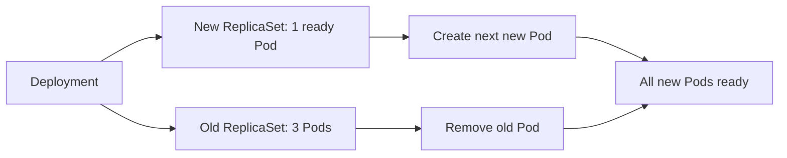

A Deployment is a controller for running an application through ReplicaSets. It records the desired Pod template and replica count, then manages versioned releases, scaling, rollout history, and rollback support.

The examples use Nginx, a web server, through Docker images such as `nginx:1.25` and `nginx:1.26`. The tag after the colon identifies the image version, so changing from `1.25` to `1.26` represents an application update.

## Deployment vs. ReplicaSet

| Deployment | ReplicaSet |
| --- | --- |
| Manages application releases and revision history | Maintains a number of matching Pods |
| Creates and adopts ReplicaSets | Creates and deletes Pods |
| Supports rolling updates and rollback | Does not coordinate application versions |
| Recommended object for most stateless applications | Lower-level controller managed by a Deployment |

## Rolling updates

When the Pod template changes, the Deployment creates a new ReplicaSet and gradually increases its Pods while reducing the old ReplicaSet. Readiness probes determine when new Pods can receive traffic.



## Rollbacks

If the new version fails its health checks or produces errors, inspect rollout history and return to the previous revision. A rollback changes the desired template; the Deployment then performs another controlled rollout.

## Deployment strategies

- **RollingUpdate**: The default. Replaces Pods gradually and can keep capacity available during a release. Tune `maxUnavailable` and `maxSurge` for the workload.
- **Recreate**: Stops all old Pods before creating new ones. This is useful when two versions cannot run at the same time, but it causes downtime.
- **Blue-green**: Run two complete environments and switch traffic between them, usually with Services. This needs more capacity but makes switching and rollback fast.
- **Canary**: Send a small share of traffic to the new version, observe it, and increase traffic progressively.

## Commands to implement it

```bash
kubectl create deployment web --image=nginx:1.25
kubectl get deployments
kubectl set image deployment/web nginx=nginx:1.26
kubectl rollout status deployment/web
kubectl rollout history deployment/web
kubectl rollout undo deployment/web
kubectl describe deployment web
```

<Note>
</Note>

## Reference link

[Kubernetes Deployments](https://kubernetes.io/docs/concepts/workloads/controllers/deployment/)
