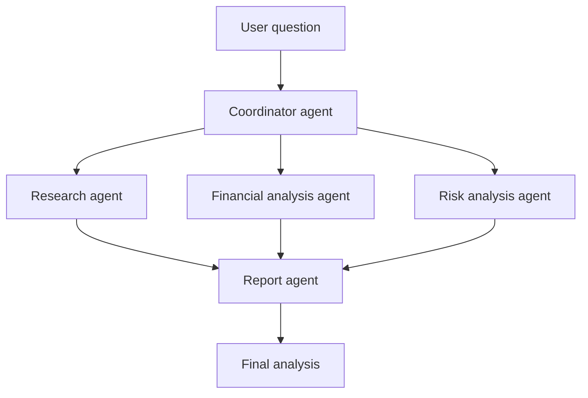

The SambaNova Agents application routes requests through specialized subgraphs for research, data science, financial analysis, artifact creation, and voice interaction. It can execute code in sandboxed environments and coordinate multiple agents.

Explore the [Agents GitHub repository](https://github.com/sambanova/agents) for setup and implementation details. Common orchestration integrations include CrewAI, LangGraph, AutoGen, ADK, Camel AI, and Agno.

## What is a multi-agent workflow?

A multi-agent workflow uses multiple specialized AI agents instead of asking one model to handle every part of a complex task. Each agent has a defined responsibility, and a coordinator agent assigns work and combines the results.

Common agent roles include:

- **Coordinator agent:** Breaks the request into tasks and assigns them.
- **Research agent:** Finds and summarizes information.
- **Data agent:** Analyzes files, calculations, or structured data.
- **Coding agent:** Writes, reviews, or tests code.
- **Review agent:** Checks the results for errors and unsupported claims.
- **Report agent:** Combines the findings into a final response.



The application controls the workflow. SambaNova models generate responses and make decisions, while the application controls permissions, tool execution, data access, and final validation.

## Practical use case: financial analysis

Suppose a user asks:

> Should we invest in this company?

A multi-agent workflow can process the request as follows:

1. The coordinator agent breaks the question into research, financial, and risk tasks.
2. The research agent gathers company and market information.
3. The financial agent analyzes revenue, profit, debt, and growth.
4. The risk agent identifies financial and market risks.
5. The report agent combines the findings into a structured report.
6. The coordinator returns findings, risks, assumptions, and any limitations.

The coordinator might ask your application to run a specialized function:

```json
{
	"name": "analyze_financial_statements",
	"arguments": {
		"company": "Example Corporation"
	}
}
```

Your application validates the company identifier, executes the function or sends the task to the appropriate agent, and returns the result to the coordinator. The coordinator can then ask the report agent to produce the final analysis.

## When to use multiple agents

Multi-agent workflows are useful when a task:

- Has several independent parts
- Requires different types of expertise
- Benefits from review or verification
- Involves multiple tools or data sources
- Is too complex for one prompt

## Operating guidelines

For reliable agents:

- Validate every tool name and argument before execution.
- Give each agent only the permissions it needs.
- Record tool calls, results, errors, and request IDs.
- Define clear completion and stop conditions.
- Require human review for high-impact decisions.
- Treat model output as analysis, not as independently verified facts.
