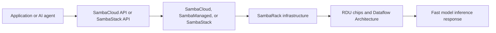

SambaNova provides everything needed to run AI models. Developers can access models through APIs, while enterprises can use managed services, dedicated platforms, complete AI racks, and purpose-built chips. All of these products support **inference**, which means using a trained AI model to generate a response for an application or user.

<Note>
  The linked SharePoint workbook requires sign-in, so private or internal offerings may not be included in this overview.
</Note>

## Presentation agenda

This presentation covers:

1. SambaNova's AI inference portfolio and how the products fit together.
2. SambaCloud and how developers access models through an API.
3. SambaManaged and private or sovereign AI inference in a customer's data center.
4. SambaStack and its hosted or on-premises full-stack deployment options.
5. SambaRack and the rack-scale infrastructure for large inference workloads.
6. Dataflow Architecture and how it manages computation and data movement.
7. RDU AI chips and their role in fast, efficient inference.
8. Real-world use cases, competitor alternatives, and the situations where SambaNova may be a strong fit.

## Choose an offering

<CardGroup cols={2}>
  <Card title="SambaCloud" icon="cloud" href="/sambacloud">
    Use managed SambaNova inference through a cloud API.
  </Card>
  <Card title="SambaManaged" icon="cloud-arrow-up" href="/sambamanaged">
    Use managed infrastructure and services for enterprise AI workloads.
  </Card>
  <Card title="SambaStack" icon="layer-group" href="/sambastack">
    Deploy a dedicated full-stack AI inference platform on-premises or in the cloud.
  </Card>
  <Card title="SambaRack" icon="server" href="/sambarack">
    Explore the rack-scale infrastructure that powers SambaStack deployments.
  </Card>
  <Card title="Dataflow Architecture" icon="diagram-project" href="/dataflow-architecture">
    Understand the dataflow architecture behind SambaNova AI systems.
  </Card>
  <Card title="RDU AI chips" icon="microchip" href="/rdu-ai-chips">
    Learn about SambaNova's purpose-built Reconfigurable Dataflow Units.
  </Card>
</CardGroup>

## How the portfolio fits together

- **SambaCloud**: The easiest place for a developer to start. An application sends a request over the internet to a SambaNova AI model and receives a response, such as a summary, answer, or generated text.
- **SambaManaged**: A managed inference cloud deployed in a customer data center, with SambaNova operating the solution.
- **SambaStack**: A dedicated full-stack inference platform that can be hosted by SambaNova or deployed on-premises.
- **SambaRack**: The integrated rack-scale hardware used to run demanding inference workloads.
- **Dataflow Architecture**: The execution model that keeps computation and data movement close together.
- **RDU**: SambaNova's Reconfigurable Dataflow Unit, the processor designed around that execution model.

## Portfolio comparison

| Offering | What it is | Deployment | Best fit | Main alternative categories |
| --- | --- | --- | --- | --- |
| SambaCloud | API-based managed inference service | SambaNova cloud | Developers and teams that want to start quickly | OpenAI, Anthropic, Google Vertex AI, AWS Bedrock, Azure AI |
| SambaManaged | Turnkey inference cloud operated in a customer data center | Customer facility with SambaNova operations | Data centers, telecoms, and organizations needing local control without building an AI platform team | GPU cloud providers, managed private AI platforms, system integrators |
| SambaStack | Dedicated hardware and software inference platform | Hosted or on-premises | Enterprises needing dedicated capacity and model control | NVIDIA DGX/HGX systems, Dell AI systems, HPE systems, Supermicro GPU systems |
| SambaRack | Integrated rack-scale inference system | Customer or dedicated data center | High-throughput, large-model, or sovereign AI deployments | NVIDIA-based GPU clusters, TPU pods, custom accelerator clusters |
| Dataflow Architecture | Hardware execution architecture | Inside SambaNova systems | Workloads where data movement, latency, and energy efficiency matter | GPU kernel-based execution, TPU dataflow approaches, custom ASICs |
| RDU | Purpose-built AI inference processor | Inside SambaRack and SambaNova platforms | Fast decode, sustained throughput, and agentic inference | NVIDIA GPUs, AMD Instinct accelerators, Google TPUs, AWS Trainium |

## Where SambaNova has an edge

SambaNova's differentiation is strongest when the requirement is **inference at scale**, rather than general-purpose training or a basic API call. Public product materials emphasize:

- A vertically integrated path from RDU silicon and Dataflow Architecture through racks, platform software, and APIs.
- Dedicated inference hardware designed to reduce unnecessary movement between compute and memory.
- Deployment choice across a public cloud API, hosted dedicated infrastructure, customer data centers, and sovereign environments.
- Support for open models and model bundles, with SambaStack documentation describing model deployment and prompt caching capabilities.
- A turnkey route for organizations that need private or sovereign inference but do not want to assemble hardware, networking, software, and operations independently.
- Published efficiency and performance claims that should be evaluated against the same model, precision, context length, concurrency, and latency target used for competitor tests.

<Warning>
  Competitor performance, pricing, supported models, availability, and service terms change frequently. Treat this page as a decision framework, and validate current claims with like-for-like benchmarks and the linked official product documentation before making a purchasing decision.
</Warning>

## Demo storyline

1. Start with **SambaCloud** to show how a developer reaches a model through an API.
2. Move to **SambaManaged** when the conversation shifts to private infrastructure and operational ownership.
3. Introduce **SambaStack** as the dedicated full-stack platform for hosted or on-premises deployments.
4. Show **SambaRack** as the rack-scale system that supplies the compute and networking foundation.
5. Finish with **Dataflow Architecture** and the **RDU** to explain why the underlying system is designed for efficient inference.

<Note>
  The product pages describe publicly available capabilities and use cases. Confirm current SKUs, model availability, deployment timelines, support terms, and benchmark conditions with SambaNova before presenting them as commitments.
</Note>

## Source links

| Link | Description |
| --- | --- |
| [SambaNova developer documentation](https://docs.sambanova.ai/docs/en/get-started/overview) | Referenced for the SambaNova API overview, quickstart, OpenAI-compatible client usage, integrations, AI Starter Kits, and SambaStack developer guidance. |
| [SambaCloud](https://sambanova.ai/products/sambacloud) | Referenced for SambaCloud's cloud inference service, supported open models, developer integrations, OpenAI-compatible endpoints, privacy positioning, and RDU-powered inference. |
| [SambaManaged](https://sambanova.ai/products/sambamanaged) | Referenced for the managed inference cloud, customer data-center deployment, sovereign AI, turnkey operations, data-center monetization, and deployment timeline claims. |
| [SambaStack](https://sambanova.ai/products/sambastack) | Referenced for the dedicated full-stack platform, hosted and on-premises deployment, model bundles, prompt caching, authentication, and enterprise inference use cases. |
| [SambaRack](https://sambanova.ai/products/sambarack) | Referenced for rack-scale infrastructure, SN50, RDU-based efficiency, multi-rack scaling, large-model inference, cooling options, and turnkey data-center deployment. |
| [Dataflow Architecture](https://sambanova.ai/products/dataflow-architecture) | Referenced for programmable compute and memory units, reduced data movement, multi-chip scaling, memory tiers, speed, energy, and agentic caching concepts. |
| [RDU AI chips](https://sambanova.ai/products/rdu-ai-chips) | Referenced for SN40 and SN50 RDU capabilities, fast decode, three-tier memory, agentic workloads, scale-out, and comparisons with GPUs and other accelerators. |

## Summary

SambaNova provides a complete path for AI inference, from a developer API to dedicated data-center infrastructure. SambaCloud is the easiest entry point for application developers. SambaManaged provides a managed private inference cloud. SambaStack combines software and dedicated hardware for hosted or on-premises deployments. SambaRack supplies the rack-scale system, while Dataflow Architecture and RDU chips provide the underlying execution technology.

The central message is that SambaNova is designed to help organizations run AI inference with a choice of cloud access, private deployment, integrated infrastructure, and purpose-built hardware. The final product decision should be based on the required model, latency, throughput, data location, power, support, availability, and total cost.