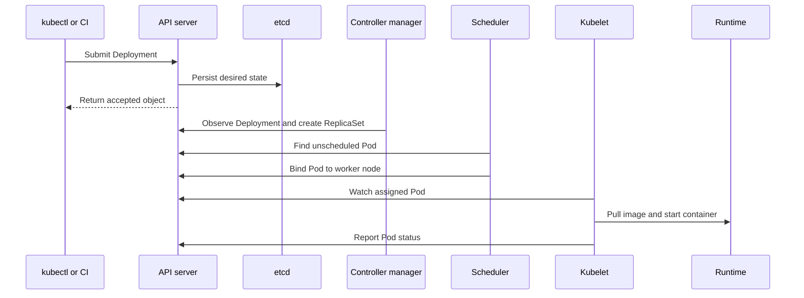

Kubernetes separates decision-making from workload execution. The control plane stores intent and coordinates the cluster. Worker nodes provide the compute where Pods actually run.

In this page, `kubectl` means the Kubernetes command-line tool, and CI means **continuous integration**: an automated system that builds and tests application changes. Both can send requests to the API server.

## Control plane vs. worker nodes

| Control plane | Worker nodes |
| --- | --- |
| Exposes and validates the Kubernetes API | Run application Pods |
| Stores cluster state | Host the container runtime |
| Schedules workloads | Run kubelet and kube-proxy |
| Reconciles desired and actual state | Report node and Pod health |

## Control plane components

<CardGroup cols={2}>
  <Card title="API server" icon="right-to-bracket">
    The authenticated front door for Kubernetes. It validates requests, serves the API, and is the coordination point for clients and controllers.
  </Card>
  <Card title="Scheduler" icon="calendar-check">
    Watches for unscheduled Pods and selects a worker node using resource capacity, constraints, affinity, and taints.
  </Card>
  <Card title="Controller manager" icon="arrows-rotate">
    Runs control loops such as Deployment and Node controllers. Each loop observes state and takes action to reach the declared state.
  </Card>
  <Card title="etcd" icon="database">
    A consistent key-value data store containing Kubernetes API state. Protect access and back it up because the cluster depends on it.
  </Card>
</CardGroup>

## Worker node components

- **Kubelet**: Receives Pod specifications, asks the container runtime to run containers, and reports health and status to the API server.
- **Container runtime**: Pulls images and starts containers. Kubernetes commonly uses containerd or CRI-O through the **Container Runtime Interface (CRI)**, which is the standard connection between Kubernetes and container software.
- **Kube-proxy**: Programs node networking rules that help route Service traffic to the right Pod endpoints.

## Cluster communication flow

When you create a Deployment, the request follows this path:



The API server is the communication hub. Components generally watch the API rather than calling each other directly, which keeps the system loosely coupled and observable.

## Inspect a cluster

```bash
kubectl get nodes -o wide
kubectl get pods -n kube-system
kubectl cluster-info dump --namespaces kube-system
kubectl get --raw='/readyz?verbose'
```

<Note>
  A healthy control plane does not guarantee a healthy application. Check node capacity, kubelet status, Pod readiness, and Service endpoints when diagnosing a request path.
</Note>

## Reference link

[Kubernetes components](https://kubernetes.io/docs/concepts/overview/components/)
