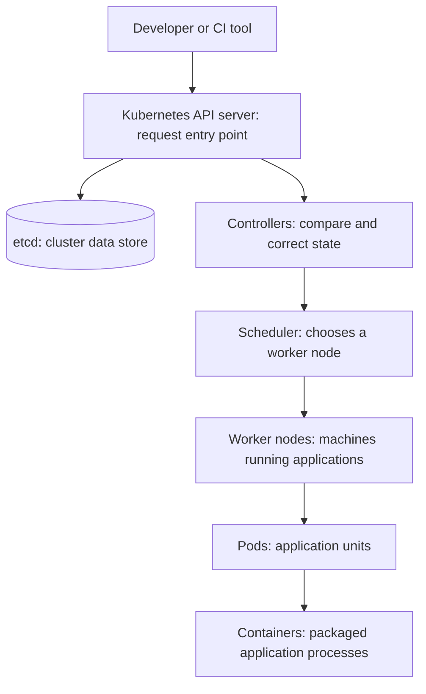
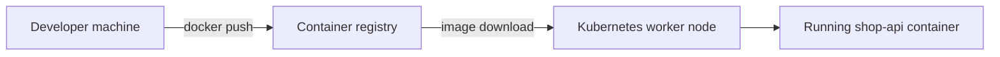

Kubernetes is an open-source platform that runs and manages applications packaged as containers. You describe the result you want, such as "keep three copies of this application running," and Kubernetes continuously works to make the real environment match that description.

The examples use `nginx:1.27`, a versioned Docker image containing the Nginx web server. It provides a simple web application for demonstrating how Kubernetes creates and exposes a workload.

## Key features

<CardGroup cols={2}>
  <Card title="Declarative management" icon="file-code">
    Describe the desired result in configuration, and Kubernetes works continuously to achieve it.
  </Card>
  <Card title="Scheduling and scaling" icon="arrows-up-down">
    Place application units on suitable machines and change their number as demand changes.
  </Card>
  <Card title="Service discovery" icon="magnifying-glass">
    Give applications a stable name and address even while individual application units are replaced.
  </Card>
  <Card title="Self-healing" icon="heart-pulse">
    Restart failed containers, replace unhealthy application units, and move work after a machine failure.
  </Card>
</CardGroup>

## Kubernetes cluster basics

A Kubernetes **cluster** is a group of connected machines that work together to run applications. It has a **control plane**, which makes decisions and stores the cluster's instructions, and **worker nodes**, which are the machines that run the applications.

The **Kubernetes API server** is the front door of the cluster. It receives requests from people and automation tools. **etcd** is Kubernetes' reliable data store: it saves information about what should be running and how the cluster is configured. **Controllers** are background processes that compare what should be running with what is actually running and correct differences. The **scheduler** chooses which worker machine should run each new application unit.

A **Pod** is the smallest unit Kubernetes places on a worker node. A Pod usually contains one **container**, which is the packaged application process. The **container runtime** is the software on a worker node that downloads images and starts containers.



### Application path in plain language

- A **Developer or CI tool** is a person or automated delivery system that submits an application change.
- The **API server** receives and validates that request.
- **etcd** records the requested configuration so Kubernetes knows what should be running.
- A **Deployment** is the application manager. It describes the application version and how many copies should run.
- A **ReplicaSet** is a helper that maintains the requested number of copies.
- A **Pod** is the unit Kubernetes creates on a worker node.
- A **container** is the packaged process inside that Pod.
- A **Service** is a stable name and network address that sends user requests to the healthy Pods, even when Pods are replaced.

The usual relationship is:

```text
Deployment -> ReplicaSet -> Pod -> Container
```

This is a management relationship, not a sequence of separate applications. The Deployment manages the ReplicaSet, the ReplicaSet manages the Pods, and each Pod runs one or more containers.

## Use cases

- Run stateless web APIs and front-end services across multiple nodes.
- Process queues with worker replicas that can scale independently.
- Perform rolling updates without taking every replica offline at once.
- Run batch jobs, scheduled tasks, and data processing workloads.
- Standardize application delivery across cloud, on-premises, and edge environments.

## Docker, Docker Swarm, and Kubernetes

Docker is primarily used to build and run containers. Docker Swarm and Kubernetes are orchestration platforms that manage containers across multiple machines.

| Area | Docker | Docker Swarm | Kubernetes |
| --- | --- | --- | --- |
| Main purpose | Build and run containers | Orchestrate Docker containers | Orchestrate containers across clusters |
| Basic workload | Container | Service | Pod |
| Replica management | Manual | Service replicas | ReplicaSet or Deployment |
| Scaling | Manual commands | `docker service scale` | Deployment scaling or HPA |
| Load balancing | Port mapping and networks | Built-in service routing | Services and Ingress |
| Self-healing | Limited container restart | Replaces failed tasks | Replaces failed Pods |
| Updates | Manual image replacement | Service updates | Rolling updates and rollbacks |
| Learning curve | Low | Medium | Higher |
| Ecosystem | Docker tools and images | Smaller ecosystem | Very large ecosystem |
| Best use case | Local development and packaging | Simple container clusters | Production platforms and complex workloads |

The closest comparison is a Docker Swarm service with three replicas and a Kubernetes ReplicaSet with three Pods. Both maintain multiple copies and replace failed copies, but they are different tools and objects.

```text
Docker builds and runs containers.
Docker Swarm manages containers simply.
Kubernetes manages containers at enterprise scale.
```

### Real-world scenario: an online shopping API

Imagine a company has an online shopping API called `shop-api`. The API handles customer login, product searches, and orders. The company uses the same image, `shop-api:1.0`, at each stage, but the platform manages that image differently as the business grows.

#### Stage 1: Docker on a developer laptop

One developer builds the image and runs one container locally. This is useful for development and testing, but the developer must manually start another container if the first one stops or if more traffic arrives.

```bash
docker build -t shop-api:1.0 .
docker run -d --name shop-api -p 8080:8080 shop-api:1.0
```

```text
One machine -> One shop-api container -> Local testing
```

#### Stage 2: Docker Swarm for a small production cluster

The company now has three servers and uses Docker Swarm. The application runs as a Swarm service with three replicas. Swarm places the containers on available servers, distributes requests, and replaces a failed container.

```bash
docker swarm init
docker service create --name shop-api --publish 8080:8080 --replicas 3 shop-api:1.0
```

```text
Three servers -> Three shop-api container replicas -> Basic production availability
```

If one server fails, Swarm attempts to start the missing replica on another available server. Scaling is performed by changing the service replica count.

```bash
docker service scale shop-api=5
```

#### Stage 3: Kubernetes for a growing production platform

The business grows and needs separate environments, automatic scaling, controlled releases, detailed access permissions, persistent storage, and multiple teams sharing the platform.

Before Kubernetes can run the image on a worker node, the image is uploaded to a **container registry**, such as Docker Hub or a private company registry. A registry is shared storage for container images. The developer uses `docker push` to upload the image, and Kubernetes uses `docker pull` or its container runtime equivalent to download the image onto a worker node.

```bash
docker login
docker tag shop-api:1.0 your-docker-id/shop-api:1.0
docker push your-docker-id/shop-api:1.0
```



The company publishes `shop-api:1.0` to the registry, and Kubernetes runs the registry image as a Deployment.

```bash
kubectl create deployment shop-api --image=your-docker-id/shop-api:1.0
kubectl scale deployment shop-api --replicas=3
kubectl expose deployment shop-api --port=8080
```

Kubernetes adds more specialized control. A Deployment manages the release, a ReplicaSet maintains the requested number of Pods, a Service provides a stable network address, and an HPA can add replicas when traffic or CPU usage increases.

```text
Kubernetes cluster -> Deployment -> ReplicaSet -> Pods -> shop-api containers
                     Service routes requests to healthy Pods
```

The application code and image can remain the same across all three stages. The difference is the management layer:

| Stage | Platform role | Example result |
| --- | --- | --- |
| Development | Docker builds and runs the image | One developer tests one container locally |
| Small production | Docker Swarm manages replicated services | Three servers run several container replicas |
| Large production | Kubernetes manages workloads and platform policies | Multiple teams run scalable, observable, and controlled applications |

<Note>
  Docker and Kubernetes are complementary. Build and test an image with Docker, publish it to a registry, and run that image in Kubernetes.
</Note>

## Example commands

`kubectl` is the command-line tool used to communicate with the Kubernetes API server. The commands below inspect the cluster, create a Deployment, and create a Service for the Nginx example.

```bash
kubectl cluster-info
kubectl get nodes
kubectl get namespaces
kubectl get pods --all-namespaces
kubectl create deployment web --image=nginx:1.27
kubectl expose deployment web --port=80
```

## Reference links

- [Kubernetes documentation](https://kubernetes.io/docs/home/)
- [Kubernetes concepts](https://kubernetes.io/docs/concepts/)
