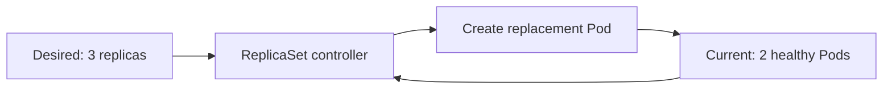

A Pod is Kubernetes' smallest deployable unit. It can contain one container or multiple tightly coupled containers that share networking and storage. Pods are intentionally replaceable: a new Pod may have a different IP address and name suffix after a failure.

The examples use `nginx:1.27`, a versioned Docker image for the Nginx web server. Nginx is a popular web server that can return web pages and receive HTTP requests. The image is only a demonstration workload; it represents the application running inside the Pod.

## What is a ReplicaSet?

A ReplicaSet maintains a requested number of matching Pods. It uses a label selector to identify its Pods, creates replacements when Pods disappear, and removes excess Pods when the count is too high. In normal application delivery, a Deployment manages the ReplicaSet for you.

## Desired vs. current state

Kubernetes stores a **desired state**, such as `replicas: 3`. The cluster continuously observes its **current state**, such as two healthy Pods. A ReplicaSet reconciles the difference by creating one more Pod. This loop provides self-healing without an operator manually counting processes.



## Scaling Pods

Change the desired replica count with a Deployment or ReplicaSet. Prefer a Deployment for application workloads because it also manages revisions and rollouts.

```bash
kubectl create deployment web --image=nginx:1.27
kubectl scale deployment web --replicas=3
kubectl get pods -l app=web -o wide
```

## Relationship between Pods and ReplicaSets

The ownership chain is usually `Deployment -> ReplicaSet -> Pods`. The Deployment creates a new ReplicaSet when the Pod template changes. The ReplicaSet then creates or deletes Pods until its count matches the Deployment's request.

## Try a Pod directly

```bash
kubectl run nginx --image=nginx:1.27
kubectl get pods -o wide
kubectl describe pod nginx
kubectl logs nginx
kubectl delete pod nginx
```

Example multi-container Pod manifest:

```yaml
apiVersion: v1
kind: Pod
metadata:
  name: web-with-sidecar
spec:
  containers:
    - name: web
      image: nginx:1.27
    - name: logger
      image: busybox:latest
      command: ["sh", "-c", "while true; do date; sleep 10; done"]
```

<Note>
  A ReplicaSet heals Pod count, but a Deployment is the usual owner for production workloads. Use a Service when clients need stable networking.
</Note>

## Reference links

- [Kubernetes Pods](https://kubernetes.io/docs/concepts/workloads/pods/)
- [Kubernetes ReplicaSets](https://kubernetes.io/docs/concepts/workloads/controllers/replicaset/)
