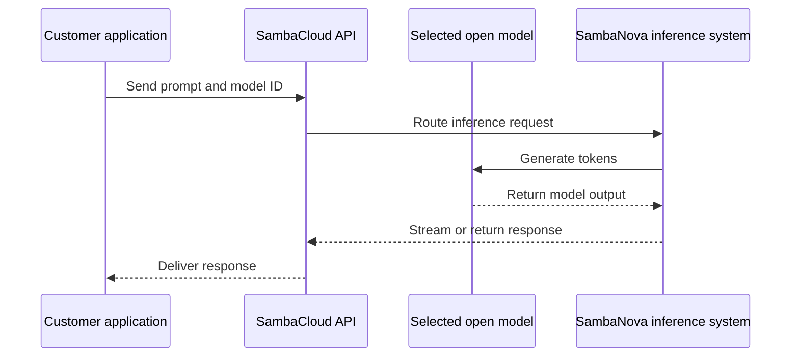

SambaCloud is SambaNova's cloud API for building applications on supported AI models. A developer sends a prompt to an endpoint, SambaNova runs inference, and the application receives generated output. It is the fastest path from an application idea to a working model call because the customer does not operate accelerators, networking, or the inference runtime.

## Real-world use cases

- Customer-support assistants that summarize conversations and draft replies.
- Coding assistants that generate, explain, or review code.
- Document extraction and classification for operations or compliance teams.
- Research and agent workflows that call a model repeatedly with different tools or context.
- High-volume text generation where latency and throughput need to be measured at production concurrency.

## How a request flows



## Example

```bash
export SAMBANOVA_API_KEY="your-api-key"
```

```python
import os
from openai import OpenAI

client = OpenAI(
    api_key=os.environ["SAMBANOVA_API_KEY"],
    base_url="https://api.sambanova.ai/v1",
)

response = client.chat.completions.create(
    model="your-model-id",
    messages=[{"role": "user", "content": "Explain SambaCloud in one sentence."}],
)
print(response.choices[0].message.content)
```

## Example response

```text
SambaCloud provides managed access to SambaNova inference capabilities.
```

This is a representative response. The exact response depends on the model and prompt used.

## SambaCloud compared with alternatives

| Option | Strength | When SambaCloud may be a better fit |
| --- | --- | --- |
| OpenAI API | Broad hosted model ecosystem and mature developer tooling | The workload benefits from SambaNova's supported open-model portfolio, inference focus, or API compatibility |
| Anthropic API | Strong hosted language-model offering | The team wants to evaluate open models and SambaNova inference performance through a compatible API |
| Google Vertex AI | Broad cloud AI platform and model catalog | The team wants a focused inference service rather than a broader cloud platform dependency |
| AWS Bedrock | Access to multiple model providers within AWS | The workload is suited to SambaNova's dedicated inference path and supported integrations |
| Azure AI | Enterprise cloud integration and governance | The team prioritizes SambaNova's inference specialization and open-model access |

## SambaNova's edge

SambaCloud's stated advantages are a developer-oriented API, OpenAI-compatible endpoints, support for open models, integrations with common AI tools, and an inference stack powered by SambaNova RDU hardware. Validate latency, throughput, model availability, data handling, and price for the exact workload before choosing a provider.

<Note>
  Model IDs, endpoints, limits, and pricing can change. Use the current SambaNova developer documentation for live values.
</Note>

