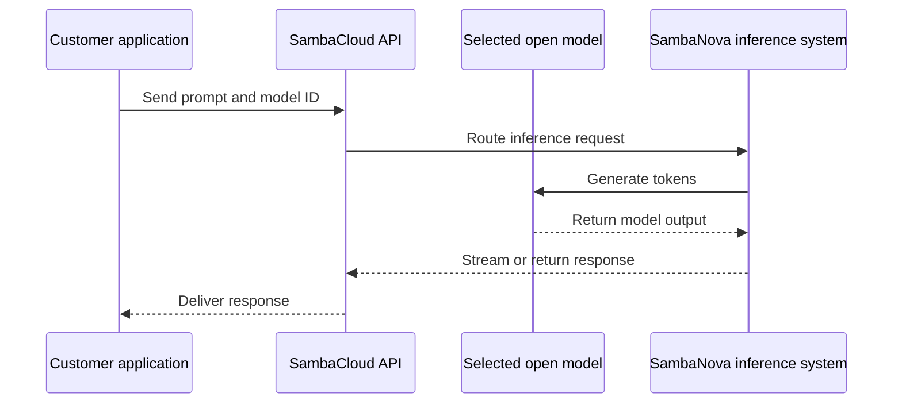

## What is SambaCloud?

SambaCloud is SambaNova's cloud service for running **AI inference**. Inference means using an already-trained AI model to produce an answer from an input, such as a question, document, or image. SambaCloud provides an **API**, which is a documented way for an application to send a request and receive a response.

The customer does not manage the accelerator chips, servers, networking, or model-serving software. The customer selects a supported model and calls the SambaNova endpoint from an application.

## Special features

- **Open-model support**: SambaCloud provides access to supported open-source models, such as Llama, DeepSeek, and Qwen. An open model is a model whose weights and usage rights are made available under its license.
- **OpenAI-compatible API**: Applications using the OpenAI client format can often connect by changing the API key, base URL, and model name. The base URL is the address where the API receives requests.
- **Developer integrations**: The official product page lists integrations with tools such as CrewAI, Hugging Face, Cline, and AWS.
- **Privacy positioning**: SambaNova states that SambaCloud does not see or collect user data or prompts. Confirm the current privacy terms for the intended account and deployment.
- **Inference-focused hardware**: SambaCloud runs on SambaNova systems powered by RDU chips. An RDU is SambaNova's Reconfigurable Dataflow Unit, a processor designed for AI inference.

## How it has an edge over competitors

| Alternative | What it provides | SambaCloud's possible edge |
| --- | --- | --- |
| OpenAI API | Hosted AI models and developer APIs | Open-model access, SambaNova's inference hardware, and OpenAI-compatible integration |
| Anthropic API | Hosted language models through an API | An alternative for teams evaluating open models and SambaNova inference performance |
| Google Vertex AI | A broad Google Cloud AI platform | A more focused inference service when a full cloud AI platform is not required |
| AWS Bedrock | Multiple model providers through AWS | A dedicated SambaNova inference path and access to supported open models |
| Azure AI | Enterprise AI services and cloud governance | A specialized alternative for inference workloads and compatible API integration |

The practical edge depends on the workload. Compare the same model, input size, output length, concurrent users, response latency, data policy, and total cost. SambaNova's published differentiators are inference speed, open-model choice, API compatibility, integrations, and privacy positioning.

## How to use SambaCloud

1. Create or access a SambaNova Cloud account.
2. Create an API key. An API key is a secret credential that authorizes an application to call the service. Store it in a secret manager or environment variable, not in source code.
3. Choose a supported model ID. A model ID is the name the API uses to identify a particular model.
4. Send a request through the SambaNova API or an OpenAI-compatible client.
5. Inspect the response, latency, error rate, and usage before moving to production.

## Real-world use cases

- Customer-support assistants that summarize conversations and draft replies.
- Coding assistants that generate, explain, or review code.
- Document extraction and classification for operations or compliance teams.
- Research and agent workflows that call a model repeatedly with different tools or context.
- High-volume text generation where latency and throughput need to be measured at production concurrency.

## How a request flows



## Example request

```bash
export SAMBANOVA_API_KEY="your-api-key"
```

```python
import os
from openai import OpenAI

client = OpenAI(
    api_key=os.environ["SAMBANOVA_API_KEY"],
    base_url="https://api.sambanova.ai/v1",
)

response = client.chat.completions.create(
    model="your-model-id",
    messages=[{"role": "user", "content": "Explain SambaCloud in one sentence."}],
)
print(response.choices[0].message.content)
```

## Example response

```text
SambaCloud provides managed access to SambaNova inference capabilities.
```

This is a representative response. The exact response depends on the model and prompt used.

<Note>
  Model IDs, endpoints, limits, and pricing can change. Use the current SambaNova developer documentation for live values.
</Note>

