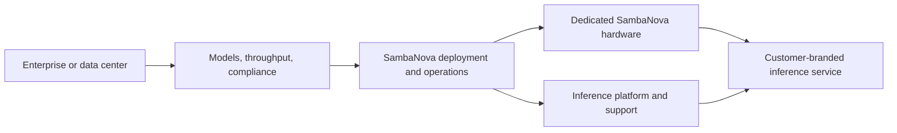

SambaManaged is a turnkey inference cloud delivered in a customer's existing data center. SambaNova provides the hardware, software, and operational support so a data center, telecom provider, or enterprise can offer AI inference without assembling and operating every platform layer itself.

## Real-world use cases

- A telecom provider launches an AI inference service for its own customers.
- A government organization keeps models, data, and compliance controls within its region.
- A data center operator monetizes existing power and floor space by offering private inference capacity.
- An enterprise wants dedicated AI capacity but does not have a team to operate accelerator infrastructure.

## Operating model

The key distinction is ownership. The system runs in the customer's facility, while SambaNova manages the end-to-end AI infrastructure and service operation under the agreed engagement.

## SambaManaged compared with alternatives

| Option | Strength | Trade-off compared with SambaManaged |
| --- | --- | --- |
| Public cloud AI service | Fast start and elastic capacity | Less control over physical placement, sovereignty, and dedicated infrastructure |
| GPU cloud provider | Dedicated accelerator capacity and cloud flexibility | Customer may still assemble or operate more of the inference platform |
| Self-built private AI cloud | Maximum infrastructure control | Requires hardware, software, platform, and operations expertise |
| System integrator solution | Custom integration across vendors | More components and responsibility to integrate and support |

## SambaNova's edge

SambaManaged is positioned around a turnkey, private inference cloud: deployment in an existing data center, SambaNova RDU-based infrastructure, operational support, and a path to sovereign AI. Public materials state a target of deployment in as little as 90 days for applicable configurations; confirm timeline, service boundaries, support commitments, and capacity for the proposed environment.

<Note>
  Confirm availability, deployment boundaries, support terms, and service-level details with SambaNova for your target environment.
</Note>

