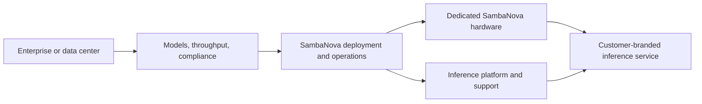

## What is SambaManaged?

SambaManaged is a **turnkey AI inference service** delivered in a customer's existing data center. Turnkey means the provider supplies an integrated solution that is ready to deploy with less assembly by the customer.

SambaNova provides the AI hardware, software, and operational support. The customer gets a private inference cloud without having to design and operate every accelerator, network, model-serving, and support layer independently.

## Special features and use cases

- A telecom provider launches an AI inference service for its own customers.
- A government organization keeps models, data, and compliance controls within its region.
- A data center operator monetizes existing power and floor space by offering private inference capacity.
- An enterprise wants dedicated AI capacity but does not have a team to operate accelerator infrastructure.

Special features include deployment in the customer's facility, a SambaNova-managed operational model, support for sovereign AI requirements, and a path for data centers to offer inference as a service. **Sovereign AI** means keeping data, models, infrastructure, and governance within a required country or organization.

## How it has an edge over competitors

| Alternative | What it provides | SambaManaged's possible edge |
| --- | --- | --- |
| Public cloud AI service | Fast access to managed AI services | More control over physical location, data residency, and dedicated infrastructure |
| GPU cloud provider | Accelerator capacity rented as a service | More integrated hardware, software, and operations for inference |
| Self-built private AI cloud | Maximum control over infrastructure | Less internal engineering and operations work |
| System integrator solution | Custom multi-vendor deployment | A single SambaNova-focused inference stack and support model |

The strongest SambaManaged case is an organization that needs private or sovereign inference but does not want to build a complete AI data-center operation. Compare deployment time, support boundaries, model coverage, power requirements, security controls, and service-level commitments.

## How to use SambaManaged

1. The customer and its application, security, and compliance stakeholders define the required models, request volume, latency, compliance, and data-location requirements with SambaNova.
2. The customer and the data center operator confirm the site's power, cooling, network, and physical capacity with SambaNova.
3. Agree on the deployment model, operations responsibility, support scope, and service levels.
4. Select the infrastructure and software configuration with SambaNova.
5. The customer's application team connects its applications to the available SambaNova interfaces.
6. Monitor usage, reliability, capacity, and operational support with SambaNova.

## Operating model

The key distinction is ownership. The system runs in the customer's facility, while SambaNova manages the end-to-end AI infrastructure and service operation under the agreed engagement.

## SambaManaged compared with alternatives

| Option | Strength | Trade-off compared with SambaManaged |
| --- | --- | --- |
| Public cloud AI service | Fast start and elastic capacity | Less control over physical placement, sovereignty, and dedicated infrastructure |
| GPU cloud provider | Dedicated accelerator capacity and cloud flexibility | Customer may still assemble or operate more of the inference platform |
| Self-built private AI cloud | Maximum infrastructure control | Requires hardware, software, platform, and operations expertise |
| System integrator solution | Custom integration across vendors | More components and responsibility to integrate and support |

## SambaNova's edge

SambaManaged is positioned around a turnkey, private inference cloud: deployment in an existing data center, SambaNova RDU-based infrastructure, operational support, and a path to sovereign AI. Public materials state a target of deployment in as little as 90 days for applicable configurations; confirm timeline, service boundaries, support commitments, and capacity for the proposed environment.

<Note>
  Confirm availability, deployment boundaries, support terms, and service-level details with SambaNova for your target environment.
</Note>

