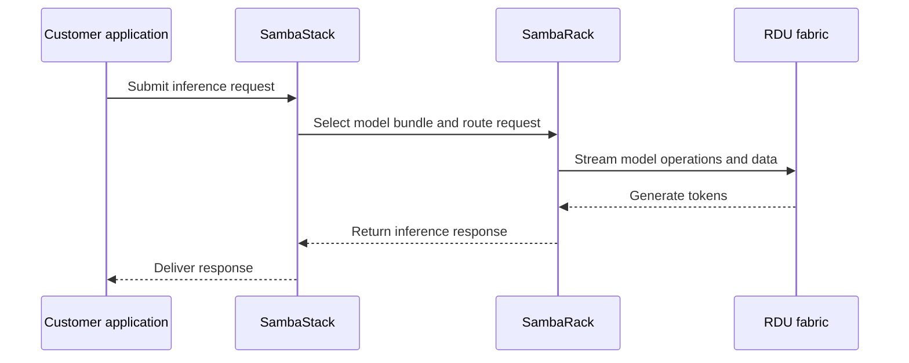

SambaRack is SambaNova's rack-scale AI inference system. It combines RDU chips, networking, and the surrounding infrastructure needed to run large inference workloads. SambaStack provides the software layer used to configure and serve models on the rack.

## Real-world use cases

- A sovereign AI data center serves national or regional workloads while keeping data in place.
- A cloud provider adds a high-throughput inference cluster to its existing data center.
- An enterprise runs large language models and agentic applications with predictable dedicated capacity.
- A data center operator deploys a turnkey AI system without designing an accelerator cluster from individual components.

## How a request uses SambaRack

## Design points

- **Integrated system**: Hardware, networking, and software are designed to work together.
- **Dataflow execution**: The RDU architecture aims to reduce unnecessary data movement between compute and memory.
- **Scale-out**: Public materials describe SN50 systems scaling across multiple racks and up to 256 accelerators for inference.
- **Deployment choice**: SambaRack can fit air-cooled or liquid-cooled data centers and supports private infrastructure scenarios.
- **Turnkey path**: SambaNova positions the system for installation and operation as a complete inference solution.

## SambaRack compared with alternatives

| Option | Strength | Trade-off compared with SambaRack |
| --- | --- | --- |
| NVIDIA GPU cluster | Broad software ecosystem and flexible workloads | More components may need to be designed, tuned, and operated together |
| Google TPU infrastructure | Strong integration with Google Cloud and selected workloads | Less suited to organizations seeking a private, vendor-integrated rack in their own facility |
| AWS Trainium or Inferentia | Cloud-native AWS integration and model economics for AWS workloads | Tied to AWS deployment and software choices |
| Custom accelerator cluster | Maximum hardware design freedom | Significant engineering, integration, and support burden |

## SambaNova's edge

SambaRack's stated edge is a turnkey, inference-focused rack built around RDU data movement efficiency, large-model capacity, and integration with SambaStack. Validate rack power, cooling, model support, network topology, deployment timeline, and benchmark conditions for the target data center.

<Note>
  SambaNova's public materials describe SambaRack SN50 as rack-scale infrastructure designed for high-throughput and agentic inference. Product specifications and availability should be confirmed for the planned deployment.
</Note>

