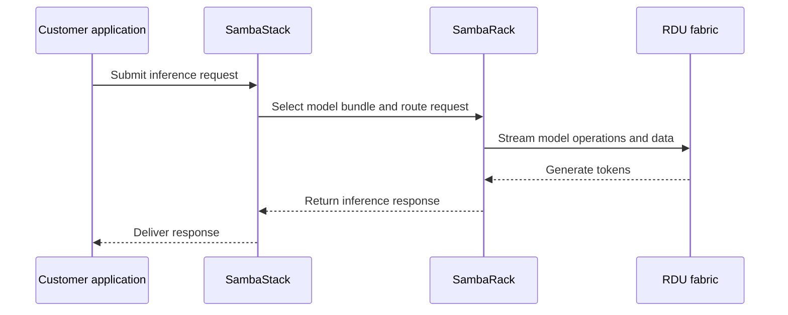

## What is SambaRack?

SambaRack is SambaNova's **rack-scale AI inference system**. Rack-scale means a complete data-center rack contains the processors, memory, networking, and supporting hardware needed to run a workload. SambaRack combines RDU chips and networking for large inference workloads, while SambaStack provides the software layer used to configure and serve models.

## Special features and real-world use cases

- A sovereign AI data center serves national or regional workloads while keeping data in place.
- A cloud provider adds a high-throughput inference cluster to its existing data center.
- An enterprise runs large language models and agentic applications with predictable dedicated capacity.
- A data center operator deploys a turnkey AI system without designing an accelerator cluster from individual components.

Special features include an integrated rack design, support for large models, scaling across multiple racks, air-cooled or liquid-cooled data-center integration, and a turnkey deployment path. **Scale-out** means adding more connected accelerator systems when demand or model size increases.

## How it has an edge over competitors

| Alternative | What it provides | SambaRack's possible edge |
| --- | --- | --- |
| NVIDIA GPU cluster | Flexible accelerator clusters and broad software support | A more integrated, inference-focused rack built around RDU dataflow execution |
| Google TPU infrastructure | Specialized AI hardware within Google Cloud | A private or dedicated data-center deployment option |
| AWS Trainium or Inferentia | AWS-native AI accelerators | A SambaNova-controlled hardware and software stack outside one hyperscaler |
| Custom accelerator cluster | Full design freedom | Less integration effort through a pre-integrated rack system |

## How a request uses SambaRack

## Design points

- **Integrated system**: Hardware, networking, and software are designed to work together.
- **Dataflow execution**: The RDU architecture aims to reduce unnecessary data movement between compute and memory.
- **Scale-out**: Public materials describe SN50 systems scaling across multiple racks and up to 256 accelerators for inference.
- **Deployment choice**: SambaRack can fit air-cooled or liquid-cooled data centers and supports private infrastructure scenarios.
- **Turnkey path**: SambaNova positions the system for installation and operation as a complete inference solution.

## How to use SambaRack

1. Define model size, request volume, latency, throughput, and data-location requirements.
2. Confirm rack space, power, cooling, networking, and data-center connectivity.
3. Choose the required SN40 or SN50 generation and system configuration with SambaNova.
4. Install and connect the rack to the data-center network and management systems.
5. Configure SambaStack, deploy model bundles, and expose the inference service to applications.
6. Measure tokens per second, time to first token, concurrent users, power use, and operational health.

<Note>
  SambaNova's public materials describe SambaRack SN50 as rack-scale infrastructure designed for high-throughput and agentic inference. Product specifications and availability should be confirmed for the planned deployment.
</Note>

