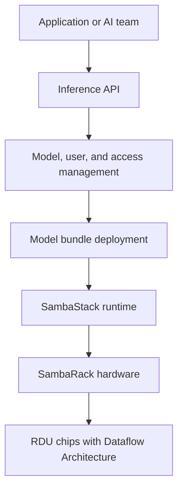
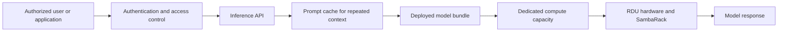

## What is SambaStack?

SambaStack is SambaNova's dedicated **full-stack AI inference platform**. Full-stack means the offering combines hardware, platform software, model deployment tools, and operational controls needed to run AI inference. It can be hosted by SambaNova or deployed in a customer's data center.

## Special features and real-world use cases

- A financial institution runs internal assistants against sensitive documents on dedicated infrastructure.
- A research organization serves open models for coding, science, or agent workloads without sharing capacity with unrelated tenants.
- A cloud provider offers a branded inference service using a pre-integrated hardware and software stack.
- An enterprise runs several model bundles and switches between them as application demand changes.

Special features include support for leading open models, model bundles, prompt caching, authentication, user groups, access control, and hosted or on-premises deployment. A **model bundle** is a prepared package containing a model and the configuration needed to deploy it. **Prompt caching** stores repeated context so later requests can reuse it instead of processing the same context again.

## How it has an edge over competitors

| Alternative | What it provides | SambaStack's possible edge |
| --- | --- | --- |
| NVIDIA DGX or HGX platform | GPU servers and a broad software ecosystem | More integrated inference hardware, software, model bundles, and operations |
| Cloud GPU instances | Flexible rented accelerator capacity | Dedicated infrastructure and a platform designed specifically for inference |
| Dell, HPE, or Supermicro AI systems | Enterprise servers and procurement support | Less customer integration work between hardware and model-serving software |
| Self-built accelerator cluster | Maximum control over the architecture | A pre-integrated path from hardware to inference service |

## How SambaStack fits together

SambaStack can be hosted or on-premises. In a hosted deployment, SambaNova manages the underlying infrastructure and Kubernetes environment while the customer manages AI services. **Kubernetes** is software that coordinates applications across multiple machines. In an on-premises deployment, the customer manages the infrastructure and Kubernetes environment after installation, while SambaNova provides the platform and support model agreed for the deployment.

## How to use SambaStack

1. Choose a hosted deployment or an on-premises deployment. Hosted means SambaNova provides the infrastructure; on-premises means the system runs in the customer's data center.
2. Define models, user groups, authentication, throughput, latency, and storage requirements.
3. Configure the SambaStack environment and its platform settings.
4. Select and deploy a supported model bundle.
5. Connect applications through the inference API.
6. Monitor model health, request performance, access, and capacity.

## Key capabilities

### 1. Deploy supported models and model bundles

SambaStack provides a controlled way to install and run supported AI models. A **model** is the trained AI system that generates an answer. A **model bundle** is a prepared package containing the model, its configuration, and the information needed by the platform to deploy it correctly.

This gives an AI team a repeatable deployment process. Instead of manually configuring hardware, libraries, model files, and serving settings for every release, the team selects an approved bundle and deploys it through the platform.

**Why it matters:** Teams can standardize model releases, reduce setup mistakes, and move from experimentation to a managed production service more consistently.

### 2. Support open models

SambaStack supports selected open models from model providers such as Meta, DeepSeek, Mistral AI, and Google, subject to the current supported-model list. **Open models** are models whose weights or usage rights are made available under a specific license.

Organizations can choose a model based on quality, language support, context size, latency, licensing, and cost instead of being limited to one proprietary model provider.

**Why it matters:** Enterprises can evaluate different models and select the model that fits a particular application, such as coding, research, customer service, or document analysis.

### 3. Authentication and user access

SambaStack can connect application and user access to enterprise identity systems. **Authentication** confirms who a person or application is. **Authorization** determines what that identity is allowed to do.

User groups can separate responsibilities. For example, an administrator may manage infrastructure, a model operator may deploy model bundles, and an application team may only send inference requests. Supported identity options described in the SambaStack documentation include OIDC, LDAP through Keycloak, and local identity management through Keycloak.

**Why it matters:** Organizations can apply existing access policies, limit sensitive actions, and keep a record of who can deploy or use each model service.

### 4. Prompt caching

**Prompt caching** stores repeated parts of a request, such as a long system instruction, policy document, or reference context. When later requests reuse that same content, the platform can reuse the cached information instead of processing it from the beginning.

For example, a customer-support assistant may use the same 50-page product policy for thousands of questions. Caching that shared policy can reduce repeated processing while each customer question remains different.

**Why it matters:** Prompt caching can reduce response latency and inference cost for applications with repeated context. The benefit depends on the cache hit rate, which is the percentage of requests that can reuse stored context.

### 5. Dedicated capacity

SambaStack runs on dedicated SambaNova infrastructure rather than sharing the same hardware with unrelated customers. **Capacity** means the available compute, memory, and network resources used to serve requests.

Dedicated capacity helps teams plan for a predictable number of users, requests, and response-time requirements. It also makes it easier to evaluate performance under a known configuration.

**Why it matters:** Predictable capacity is important for internal enterprise assistants, regulated workloads, high-volume APIs, and applications with strict latency requirements.

### 6. Full-stack integration

SambaStack combines several layers in one platform:

- **RDU hardware**: Purpose-built processors that run AI inference.
- **SambaRack infrastructure**: The rack-scale servers, memory, and networking that provide the physical compute environment.
- **SambaStack software**: The platform used to configure infrastructure, deploy models, manage users, and serve requests.
- **Inference interfaces**: APIs that applications use to send prompts and receive model responses.

The application team interacts with the inference interface, while the platform connects that request to the model, software runtime, and underlying hardware.

**Why it matters:** A pre-integrated stack reduces the amount of separate hardware, software, networking, and model-serving integration that the customer must design and support.

### Capability flow

<Note>
  SambaStack is a full-stack offering combining purpose-built hardware, software, model support, and deployment options.
</Note>

