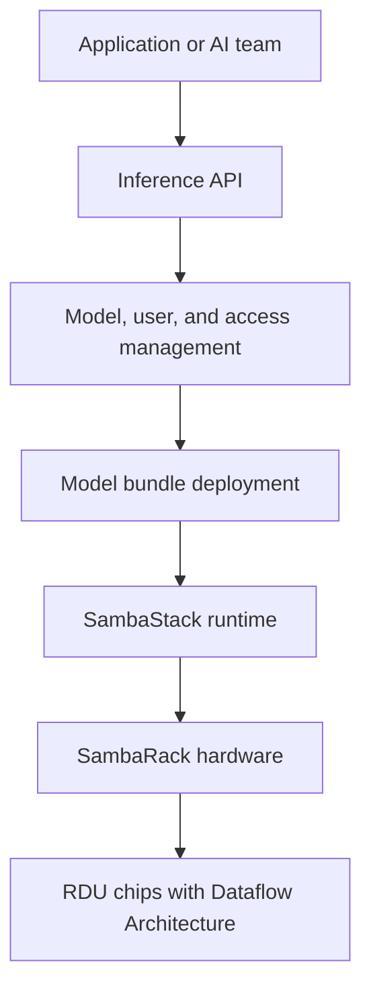

SambaStack is SambaNova's dedicated full-stack AI inference platform. It combines purpose-built hardware, platform software, model bundles, and operational controls. It can be hosted by SambaNova or deployed in a customer's data center.

## Real-world use cases

- A financial institution runs internal assistants against sensitive documents on dedicated infrastructure.
- A research organization serves open models for coding, science, or agent workloads without sharing capacity with unrelated tenants.
- A cloud provider offers a branded inference service using a pre-integrated hardware and software stack.
- An enterprise runs several model bundles and switches between them as application demand changes.

## How SambaStack fits together

SambaStack can be hosted or on-premises. In a hosted deployment, SambaNova manages the underlying infrastructure and Kubernetes environment while the customer manages AI services. In an on-premises deployment, the customer manages the infrastructure and Kubernetes environment after installation, while SambaNova provides the platform and support model agreed for the deployment.

## Capabilities to discuss

- Model and bundle deployment for supported open models.
- Authentication and user-group controls for enterprise access.
- Prompt caching for repeated context and agent workflows.
- Dedicated capacity for predictable inference performance.
- A full-stack path from hardware to model-serving interfaces.

## SambaStack compared with alternatives

| Option | Strength | Trade-off compared with SambaStack |
| --- | --- | --- |
| NVIDIA DGX or HGX platform | Broad GPU ecosystem and software compatibility | The customer assembles more of the model-serving and platform layers |
| Cloud GPU instances | Flexible procurement and broad infrastructure choice | Less purpose-built integration between hardware and inference software |
| Dell, HPE, or Supermicro AI systems | Enterprise hardware procurement and support | Usually requires additional software integration for a complete inference platform |
| Self-built accelerator cluster | Maximum architecture control | Higher engineering and operations burden |

## SambaNova's edge

SambaStack's stated edge is integration: dedicated SambaNova hardware and software, support for leading open models, hosted or on-premises deployment, model bundles, and a platform designed specifically for inference. The right comparison should measure the full system, including model serving, power, networking, operations, and time to production, rather than comparing a chip or server in isolation.

<Note>
  SambaStack is a full-stack offering combining purpose-built hardware, software, model support, and deployment options.
</Note>

