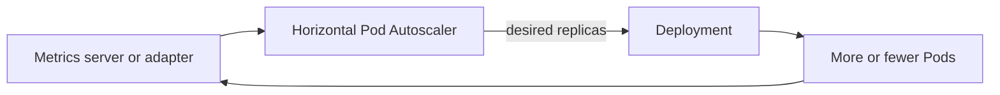

Kubernetes can scale workloads manually or automatically, then release new versions gradually. The goal is to provide enough capacity for demand while keeping deployments available and reversible. The update example uses Nginx, a web server, and changes its Docker image tag from `1.25` to `1.26` to represent a new version.

## Manual scaling

Manual scaling changes the Deployment's desired replica count immediately. It is useful for a planned event, a quick experiment, or a temporary response while you investigate traffic.

```bash
kubectl scale deployment web --replicas=5
kubectl get deployment web
kubectl get pods -l app=web
```

## Horizontal Pod Autoscaler basics

The **Horizontal Pod Autoscaler (HPA)** watches a workload metric and adjusts the number of Pod copies between a minimum and maximum. CPU and memory are common signals, but custom or external metrics can represent queue depth, request rate, or latency more directly.



HPA requires resource requests for resource-based calculations and a metrics provider. It should be paired with sensible startup time, readiness probes, and application capacity testing.

## Rolling updates and zero downtime

A rolling update creates new Pods while reducing old Pods. To avoid downtime, keep more than one ready replica, configure a readiness probe, and tune `maxUnavailable` and `maxSurge`. A Service should send traffic only to ready endpoints.

Zero downtime is a system property, not a single command. The application must tolerate overlapping versions, database changes should be backward compatible, and the cluster must have enough spare capacity for the rollout.

## Rollbacks

Kubernetes records Deployment revisions. If a rollout fails, inspect its status and history, then restore a known-good revision. Confirm that the rollback becomes ready before considering the incident resolved.

## Commands to implement it

```bash
kubectl scale deployment web --replicas=5
kubectl autoscale deployment web --min=2 --max=10 --cpu-percent=70
kubectl get hpa
kubectl set image deployment/web nginx=nginx:1.26
kubectl rollout status deployment/web
kubectl rollout undo deployment/web
kubectl rollout status deployment/web
kubectl get rs
```

<Note>
  HPA needs metrics from a metrics provider. Readiness probes and multiple replicas help an application maintain availability during rolling updates.
</Note>

## Reference link

[Kubernetes autoscaling](https://kubernetes.io/docs/concepts/workloads/autoscaling/)
