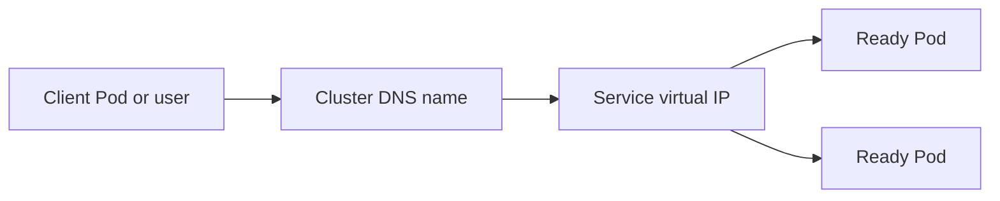

A Service provides a stable virtual endpoint for a changing set of Pods. It selects Pods by labels and tracks their ready endpoints, so clients do not need to know individual Pod IP addresses.

The command examples use `nginx:1.27`, a Docker image containing the Nginx web server. The temporary `curlimages/curl` image contains `curl`, a command-line tool that sends HTTP requests so one Pod can test another Service.

## How traffic moves



## Service types

- **ClusterIP**: Internal cluster access, and the default type.
- **NodePort**: Exposes a port on each node.
- **LoadBalancer**: Requests an external load balancer from a supported environment.
- **Ingress**: Routes HTTP or HTTPS traffic to Services through an Ingress controller.

### ClusterIP

The default type. It exposes the Service only inside the cluster and is ideal for internal API-to-API calls, such as a checkout service calling a payments service.

### NodePort

Opens a port on every node and forwards traffic to the Service. It is useful for simple labs and some on-premises setups, but it exposes a lower-level node port that is less ergonomic than a managed load balancer.

### LoadBalancer

Asks the infrastructure provider to provision an external load balancer. It is a common way to expose one Service directly to users when the environment supports it.

### Ingress basics

Ingress defines HTTP or HTTPS routing rules, such as sending `shop.example.com/api` to an API Service and `/` to a front-end Service. An Ingress controller must be installed to implement those rules; the Ingress object alone does not create a load balancer.

## DNS in Kubernetes

Kubernetes DNS gives Services stable names. A Pod in the same namespace can call `web-svc`; a fully qualified name is `web-svc.default.svc.cluster.local`. DNS records point to the Service, while the Service selects changing Pod endpoints.

## Pod-to-Pod communication

Kubernetes networking aims for every Pod to be able to communicate with every other Pod without network address translation. A **Container Network Interface (CNI) plugin** is the networking software that creates Pod network connections. Use a Service for stable discovery and **NetworkPolicies**, which are rules that allow or block traffic, when communication must be restricted.

## Commands to implement it

```bash
kubectl expose deployment web --name=web-svc --port=80 --target-port=80
kubectl get services
kubectl describe service web-svc
kubectl run temporary-client --rm -it --image=curlimages/curl -- curl http://web-svc
```

<Note>
</Note>

## Reference link

[Kubernetes Services, Load Balancing, and Networking](https://kubernetes.io/docs/concepts/services-networking/)
