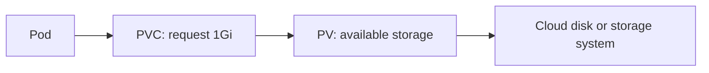

Containers are disposable, so data written only to a container's writable layer disappears when that container is removed. Storage is needed for databases, uploaded files, reports, and any data that must survive Pod replacement.

## Volumes

A volume gives a container a filesystem location backed by storage outside its writable layer. An `emptyDir` volume is temporary storage created when a Pod starts and deleted when that Pod is removed. Network, cloud, or node-backed volume types can provide durable storage, depending on the cluster.

## PersistentVolumes and PersistentVolumeClaims

A **PersistentVolume (PV)** represents storage made available to the cluster. A **PersistentVolumeClaim (PVC)** is a workload's request for capacity, access mode, and sometimes a **StorageClass**, which describes how the cluster provisions a particular kind of storage. The application references the claim, rather than depending on the details of a particular disk.



Common access modes include `ReadWriteOnce` for one node mounting a volume read-write, `ReadOnlyMany` for many nodes reading, and `ReadWriteMany` when the storage backend supports concurrent writes.

## Storage lifecycle

1. A cluster administrator or provisioner makes storage available.
2. A developer creates a PVC describing capacity and access mode.
3. Kubernetes binds the PVC to a suitable PV.
4. A Pod mounts the PVC and uses the storage.

The claim and Pod are separate objects. A PVC can remain after a Pod is deleted, depending on its reclaim policy, which helps protect application data during rescheduling.

## Commands to implement it

```bash
kubectl get storageclass
kubectl get persistentvolumes
kubectl get persistentvolumeclaims
kubectl describe pvc data-claim
kubectl apply -f storage.yaml
```

Example claim:

```yaml
apiVersion: v1
kind: PersistentVolumeClaim
metadata:
  name: data-claim
spec:
  accessModes: ["ReadWriteOnce"]
  resources:
    requests:
      storage: 1Gi
```

<Note>
  Storage behavior depends on the cluster's StorageClass and provisioner. Review reclaim policies and backup procedures before storing production data.
</Note>

## Reference link

[Kubernetes storage](https://kubernetes.io/docs/concepts/storage/)
